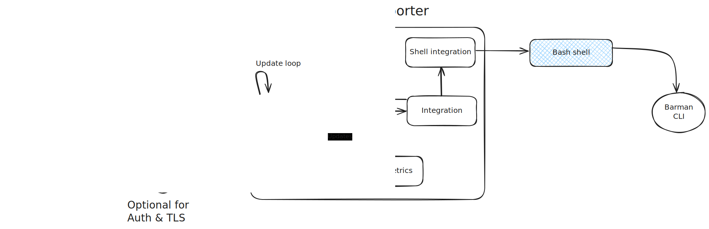

# Overview
This application provides a set of metrics for the state of [pgbarman](https://pgbarman.org/). It is meant as replacement for [prometheus-barman-exporter](https://github.com/marcinhlybin/prometheus-barman-exporter), which appears to be inactive for some time. 

All metrics provided by [prometheus-barman-exporter](https://github.com/marcinhlybin/prometheus-barman-exporter) are supported and unchanged.
```
# HELP barman_backup_size Outputs the size of a specific backup(for specific server) in bytes
# TYPE barman_backup_size gauge
barman_backup_size{number="0",server="pg"} 5.5210398e+07
barman_backup_size{number="1",server="pg"} 5.5210398e+07
# HELP barman_backup_wal_size Outputs the size of a the wals for specific backup(for specific server) in bytes
# TYPE barman_backup_wal_size gauge
barman_backup_wal_size{number="0",server="pg"} 3.3554432e+07
barman_backup_wal_size{number="1",server="pg"} 3.3554432e+07
# HELP barman_backups_failed Outputs the current number of backups with status FAILED for specific server
# TYPE barman_backups_failed gauge
barman_backups_failed{server="pg"} 0
# HELP barman_backups_total Outputs the current number of available backups for specific server
# TYPE barman_backups_total gauge
barman_backups_total{server="pg"} 2
# HELP barman_first_backup Time since the first backup was taken in seconds
# TYPE barman_first_backup gauge
barman_first_backup{server="pg"} 4.184067e+06
# HELP barman_last_backup Time since the last backup was taken in seconds
# TYPE barman_last_backup gauge
barman_last_backup{server="pg"} 4.184067e+06
# HELP barman_last_backup_copy_time Outputs the time it took to get the latest backup in seconds
# TYPE barman_last_backup_copy_time gauge
barman_last_backup_copy_time{server="pg"} 8.239298
# HELP barman_metrics_update Outputs the time(in ms) it took update all metrics exporter by this exporter
# TYPE barman_metrics_update gauge
barman_metrics_update 2
# HELP barman_up Barman status checks
# TYPE barman_up gauge
barman_up{check="archiver_errors",server="pg"} 1
barman_up{check="backup_maximum_age",server="pg"} 1
barman_up{check="compression_settings",server="pg"} 1
barman_up{check="directories",server="pg"} 1
barman_up{check="failed_backups",server="pg"} 1
barman_up{check="minimum_redundancy_requirements",server="pg"} 1
barman_up{check="pg_basebackup",server="pg"} 1
barman_up{check="pg_basebackup_compatible",server="pg"} 1
barman_up{check="pg_basebackup_supports_tablespaces_mapping",server="pg"} 1
barman_up{check="pg_receivexlog",server="pg"} 1
barman_up{check="pg_receivexlog_compatible",server="pg"} 1
barman_up{check="postgresql",server="pg"} 1
barman_up{check="postgresql_streaming",server="pg"} 1
barman_up{check="receive_wal_running",server="pg"} 1
barman_up{check="replication_slot",server="pg"} 1
barman_up{check="retention_policy_settings",server="pg"} 1
barman_up{check="superuser_or_standard_user_with_backup_privileges",server="pg"} 1
barman_up{check="systemid_coherence",server="pg"} 1
barman_up{check="wal_level",server="pg"} 1
barman_up{check="wal_maximum_age",server="pg"} 1
barman_up{check="wal_size",server="pg"} 1
```

In addition to those metrics ther are 3 new ones:
```
# HELP barman_last_backup_throughput Outputs the throughput(in bytes/second) during the last backup creation
# TYPE barman_last_backup_throughput gauge
barman_last_backup_throughput{server="pg"} 4.664618514829783e+06
# HELP barman_last_backup_wal_files outputs the number of wals for the last backup
# TYPE barman_last_backup_wal_files gauge
barman_last_backup_wal_files{server="pg"} 2
# HELP barman_last_backup_wal_rate_per_second Outputs the wal rate for the last backup
# TYPE barman_last_backup_wal_rate_per_second gauge
barman_last_backup_wal_rate_per_second{server="pg"} 0.05102330047234898
```
# Architecture 


The diagram above gives a simple overview of how the setup looks. 
The metrics can be scraped by any agent capable of parsing prometheus metrics format. Including but not limited to [Grafana Alloy](https://grafana.com/docs/alloy/latest/reference/components/prometheus/prometheus.scrape/), [DataDog](https://docs.datadoghq.com/containers/kubernetes/prometheus/?tab=kubernetesadv2), [NetRelic](https://docs.newrelic.com/docs/infrastructure/prometheus-integrations/get-started/send-prometheus-metric-data-new-relic/)


The setup can optionally include application servers such as Nginx or Caddy to provide TLS and authentication. The exporter has none of those built-in. 

The exporter it's self is simple application which provides two things:
1. HTTP server for serving the metrics
2. Update loop which updates all metrics based on the `refresh_interval` field in the config yaml.
>
> **Update loop**  
>The update loop forks a process to execute barman CLI commands. Once the command is executed, its output is returned as struct from the `outputs` package. Later on those structs are used to update the metrics generated by OTEL Metrics package. 
>Because all actions are asynchronous, caching is utilized to prevent executing the same > barman command more often than neccesserry. 
>
The integration module forks a process with the `barman cli`, all environment variables passed to the exporter are passed to the barman CLI as well.


**NOTE:**  
 There appears to be HTTP API for barman. The code can be found in [https://github.com/emin100/barmanapi](https://github.com/emin100/barmanapi). The API is also mentioned in the [official documentation](https://docs.pgbarman.org/release/3.10.0/#links), however the last commit for the project was 8 years ago. This exporter doesn't support it.
# Deployment and configuration

## Installation
## Systemd service
In order to make managing the state of the exporter, the following unit file can be used:
> Assuming that the exporter executable is stored in `/opt/barman_exporter/exporter` and the configuration is in `/etc/barman_exporter/config.yaml`
```
[Unit]
Description=Barman Metric Exporter
After=network-online.target
ConditionPathExists=/opt/barman_exporter/exporter
ConditionPathExists=/etc/barman_exporter/config.yaml

[Service]
Type=simple
User=barman
Group=barman
ExecStart=/opt/barman_exporter/exporter -config /etc/barman_exporter/config.yaml
SyslogIdentifier=barman_exporter
Restart=always
ExecReload=kill -SIGUSR1 $MAINPID

[Install]
WantedBy=multi-user.target
```
## Configuration 
The executable takes a single argument `-config` which must point to yaml file containg the configuration for the instance

The configuration options are as follows:

`NOTE: All options are first-level, the yaml is not nested in any way!`
| Option | Description |
| ----------------- | ----------- | 
| port              | Port on which the exporter accepts connections |
| address           | The address to bind to, recommended to be 127.0.0.1/localhost because of lack of authorization features. Set to 0.0.0.0 to listen for connections from everywhere   |
| integration_type  | Integration type to use, mock is for testing, shell when the barman command must be used |
| cache_ttl         | Time to cache barman responses in seconds. This is used to prevent running barman commands all the time | 
| checks_cache_ttl  | Time to cache barman response for `barman check` command in seconds. | 
| refresh_interval  | How often to connect to the integration and regenerate the metrics. This value must be larger than TTL, though not enforced |
| log_level         | How much details to log. Available levels are `ERROR`,`WARN`,`INFO` and `DEBUG`. Default is `WARN`|

Example config:
```yaml
address: 127.0.0.1
port: "2222"
integration_type: "shell"
cache_ttl: 50
checks_cache_ttl: 50
refresh_interval: 60
log_level: "warn"
```
## Scraping
### Grafana agent/alloy
Here is example configuration block for scrapping the exporter with Grafana Alloy
```
prometheus.scrape "barman_scraper" {
  targets = [
    {"__address__" = "localhost:2222", "instance" = "barman" }, # Add any extra tags, fell free to remove the instance tag
  ]

  forward_to = [prometheus.remote_write.default.receiver] # Change this to proper receiver

  scrape_interval = "60s"
  metrics_path    = "/metrics"
}
```
# Troubleshooting
## Known problems
Sometimes `barman check` command can be very slow(minutes), for example when there are a lot of tablespaces, barman uses `SELECT sum(pg_tablespace_size(oid)) FROM pg_tablespace` query which can take a lot of time to compute. In those scenarios you can increase the cache time to live for the check command. This will result in fewer execution of `barman check` and hence it will take longer to detect issues.

Reference: https://github.com/EnterpriseDB/barman/issues/75

## Generic guidelines for submitting issue 
1. Turn on the debug logs
2. If a specific command is slow/throwing error try to run the command manually. From the debug log you must be able to see both the executed command, its execution time and any error encountered by the exporter. 

**NOTE: The debug logs contain logId which you can use to search for all logs related to specific command**  

3. If the command is working manually but the exporter is still unable to execute it and parse the result open ticket with info about the command, the debug logs from the command execution(all debug logs are fine) and the output of the manually executed command in JSON format(`barman -f json ...`)

